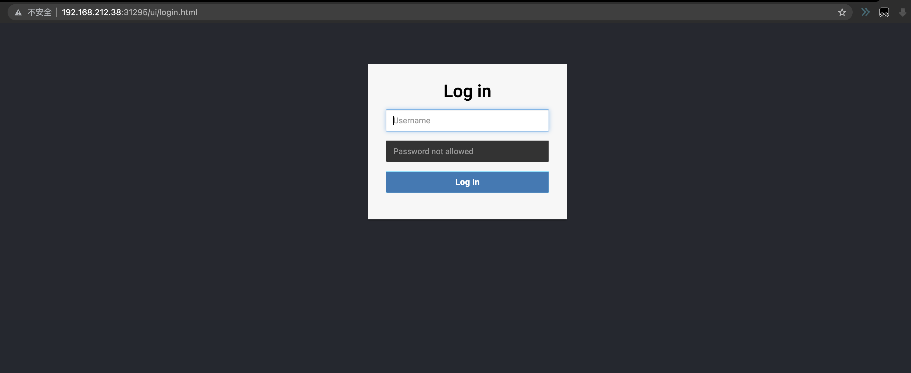

## How use it 
1. install trino-operator
```shell
# install
> helm install trino-operator ./chart
# verify
> kubectl get -n trino-system deployments trino-controller-manager
NAMESPACE      NAME                       READY   UP-TO-DATE   AVAILABLE   AGE
trino-system   trino-controller-manager   1/1     1            1           72s
```

2. add crd resource config, the tarim_v1_trino.yaml e.g: 

```shell
> kubectl apply -f config/samples/tarim_v1_trino.yaml
trino.tarim.deepexi.com/trino-sample created

> kubectl get trinos.tarim.deepexi.com trino-sample
NAME           TOTALCPU   TOTALMEMORY   COORDINATORNUM   WORKERNUM   PAUSE
trino-sample   3          3             1                2           false

>  kubectl get pods
NAME                                       READY   STATUS              RESTARTS   AGE
trino-sample-coordinator-9c9d4c79b-lmctw   0/1     ContainerCreating   0          51s
trino-sample-worker-5f57b75674-2w2qz       0/1     ContainerCreating   0          51s
trino-sample-worker-5f57b75674-rs25d       0/1     ContainerCreating   0          51s

> kubectl get svc
NAME                       TYPE        CLUSTER-IP       EXTERNAL-IP   PORT(S)          AGE
kubernetes                 ClusterIP   10.96.0.1        <none>        443/TCP          4h50m
trino-sample-nodeservice   NodePort    10.98.149.214    <none>        8080:31295/TCP   84s
trino-sample-trino         ClusterIP   10.109.139.133   <none>        8080/TCP         84s
```

#### when trino-sample-coordinator is ready,visit [http://nodeIp:nodePort](http://nodeIp:31295)


#### see the coordinator and worker status in trino status

```shell
> kubectl get trinos.tarim.deepexi.com trino-sample -oyaml 
apiVersion: tarim.deepexi.com/v1
kind: Trino
metadata:
  generation: 1
  name: trino-sample
  namespace: default
spec:
  ...
status:
# coordinator status
  coordinatorPod:
  - cpu: "1"
    memory: "1000"
    name: trino-sample-coordinator-9c9d4c79b-9tcbd
    podStatus: Running
    # when coordinator pod is ready, nodeport serice is able to use
    ready: true
# status for all trino cluster
# 	STOPPED  when trino.spec.pause is true
#	RUNNING      when trino.spec.pause is false and all workload is running
#	TRANSITIONING  when trino.spec.pause is false and workload is not ready
  status: RUNNING
  totalCpu: 3
  totalMemory: 3
# worker status
  workerPod:
  - cpu: "1"
    memory: "1"
    name: trino-sample-worker-5f57b75674-5hgh2
    podStatus: Running
    ready: true
  - cpu: "1"
    memory: "1"
    name: trino-sample-worker-5f57b75674-9f9tq
    podStatus: Running
    ready: true
```

### config example:
```yaml
apiVersion: tarim.deepexi.com/v1
kind: Trino
metadata:
  name: trino-sample
spec:
#  cat log config 
#  will use in coordinator and worker
  cataLogConfig:
    tpcdsProperties: |
      connector.name=tpcds
      tpcds.splits-per-node=4
    tpchProperties: |
      connector.name=tpch
      tpch.splits-per-node=4
## coordinator config
  coordinatorConfig:
    configProperties: |
      coordinator=true
      node-scheduler.include-coordinator=false
      http-server.http.port=8080
      query.max-memory=1GB
      query.max-memory-per-node=512MB
      query.max-total-memory-per-node=1GB
      memory.heap-headroom-per-node=512MB
      discovery.uri=http://localhost:8080
    jvmConfig: |
      -server
      -Xmx2G
      -XX:+UseG1GC
      -XX:G1HeapRegionSize=32M
      -XX:+UseGCOverheadLimit
      -XX:+ExplicitGCInvokesConcurrent
      -XX:+HeapDumpOnOutOfMemoryError
      -XX:+ExitOnOutOfMemoryError
      -Djdk.attach.allowAttachSelf=true
      -XX:-UseBiasedLocking
      -XX:ReservedCodeCacheSize=512M
      -XX:PerMethodRecompilationCutoff=10000
      -XX:PerBytecodeRecompilationCutoff=10000
      -Djdk.nio.maxCachedBufferSize=2000000
    logProperties: |
      io.trino=INFO
    nodeProperties: |
      node.environment=production
      node.data-dir=/data/trino
      plugin.dir=/usr/lib/trino/plugin
    # now coordinator support num is 1
    num: 1
    # cpu request, units is core
    # default 1
    cpuRequest: 1
    # memory request, units is m   
    # default 2048
    memoryRequest: 1000
  workerConfig:
    # is improtant, jvm will not work if  use error config.
    # change query.max-memory,query.max-memory-per-node,query.max-total-memory-per-node,memory.heap-headroom-per-node.
    # In general:
    #     query.max-memory is bigger then query.max-memory-per-node.
    #     query.max-total-memory-per-node  is bigger then memory.heap-headroom-per-node.
    #     coordinator discovery.uri is discovery.uri=http://trino-sample-trino:8080, do not change it.
    #     worker discovery.uri=http://{trino-name}--trino:8080, eg: this file name is trino-sample,so discovery.uri=http://trino-sample-trino:8080
    configProperties: |
      coordinator=false
      node-scheduler.include-coordinator=false
      http-server.http.port=8080
      query.max-memory=1GB
      query.max-memory-per-node=512MB
      query.max-total-memory-per-node=1GB
      memory.heap-headroom-per-node=512MB
      discovery.uri=http://trino-sample-trino:8080
    jvmConfig: |
      -server
      -Xmx2G
      -XX:+UseG1GC
      -XX:G1HeapRegionSize=32M
      -XX:+UseGCOverheadLimit
      -XX:+ExplicitGCInvokesConcurrent
      -XX:+HeapDumpOnOutOfMemoryError
      -XX:+ExitOnOutOfMemoryError
      -Djdk.attach.allowAttachSelf=true
      -XX:-UseBiasedLocking
      -XX:ReservedCodeCacheSize=512M
      -XX:PerMethodRecompilationCutoff=10000
      -XX:PerBytecodeRecompilationCutoff=10000
      -Djdk.nio.maxCachedBufferSize=2000000
    logProperties: |
      io.trino=INFO
    nodeProperties: |
      node.environment=production
      node.data-dir=/data/trino
      plugin.dir=/usr/lib/trino/plugin
    # num of worker
    # default 1
    num: 2
    # cpu request, units is core
    # default 1
    cpuRequest: 1
    # memory request, units is m   
    # default 2048
    memoryRequest: 1000
  # true : crd resource will be created but no pod
  # default false 
  pause: false
  # add node port 
  # default true
  nodePort: true
```


### Release Note

#### version 0.1
- [X] Basis function
- [X] add a trino cluster in kubernetes
- [X] edit crds to change config, restart the necessary parts
- [X] add or delete worker when just change the num
- [X] watch deployment and pod, logs trino coordinator and worker status in **trinos** status items


#### In next  0.2 version
- [ ] change deploy to stateful and add more settings
- [ ] add metrics, use prometheus or others
- [ ] fix TOTALCPU and TOTALMEMORY units